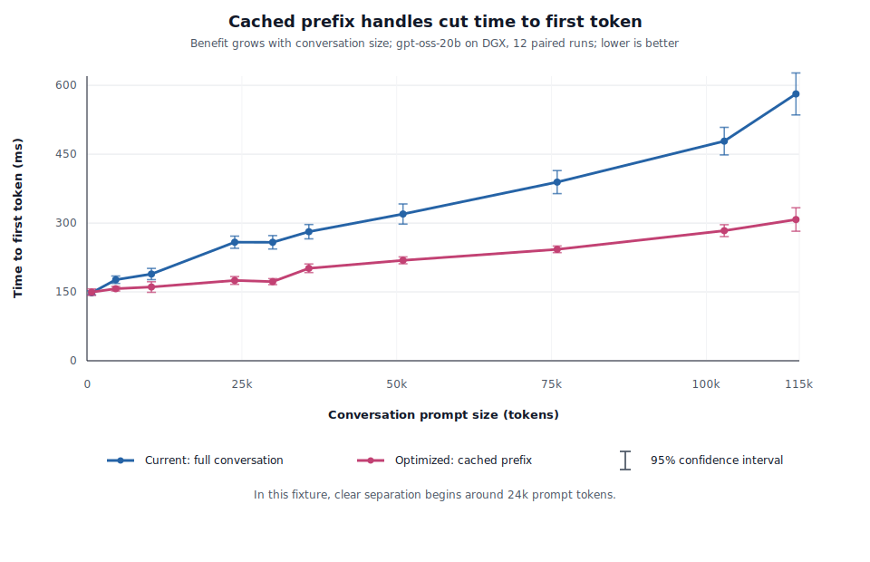

# ADR-04 - Cached prompt-token prefixes for vLLM Responses conversations

> **Status:** Draft
> **Date:** 2026-06-18
> **Related:** [ADR-01 - Core Architecture](ADR-01_core.md), [ADR-02 - Response Store](ADR-02_response_store.md), [ADR-03 - Layered Crate Architecture](ADR-03_gateway_integration.md)

---

## Motivation

Responses continuation lets clients send only new input, but the serving stack can still pay cumulative
work internally. Today `agentic-api` can rehydrate prior items from the response store, then send a full
logical `/v1/responses` request upstream. vLLM then reconstructs the model-visible prompt, tokenizes the
full accumulated context, checks prefix-cache reuse, and decodes.

For long agentic loops, the repeated prompt-construction cost becomes visible after automatic prefix
caching (APC) has already removed most GPU prefill work. The goal is to make continuation efficient at
the same level as the API contract: only the marginal turn should need to move through the hot path.

The production target is:

```text
validated cached prefix handle + marginal token suffix
```

---

## Responses and Conversation APIs

The Responses API is the inference-facing protocol boundary for this ADR. A client can continue a prior
Responses turn with `previous_response_id`; `agentic-api` uses the response store to rehydrate the
prior ordered items, then calls vLLM's upstream `/v1/responses`.

The Conversation API is a state-management convenience over the same continuation problem. A request can
attach to a durable conversation whose ordered `Conversation.item_ids` is the history source. A stored
`Response` can belong to that conversation, but should not duplicate the same ordered history in
`Response.history_item_ids`.

For token-prefix caching, both APIs converge to the same hot-path requirement: load the ordered prior
model-visible items, prove the cached prompt-token prefix still matches that history and the active
renderer/template, then send only the marginal suffix through the replay path.

---

## Proposal

Use a guarded cached-prefix replay design for Responses conversations.

`agentic-api` should persist durable prompt-token prefix metadata with the conversation state. vLLM
should remain the authority for rendering, tokenization, prompt-cache handle execution, and generation.
The hot replay path should send a server-side prefix reference plus only the marginal appended token IDs.

This is not Harmony-specific. Harmony is the renderer used by the measured GPT-OSS workload, but the
cache contract is model-visible token prefix reuse. Any Responses-served model can benefit when:

- vLLM builds a model-visible prompt from Responses input;
- the prefix token IDs can be proven compatible with the current model, tokenizer, renderer, and template;
- the append point is a safe renderer/template boundary; and
- the selected serving engine has, can load, or can cheaply reconstruct the matching KV blocks.

For GPT-OSS, those safe append points are Harmony message boundaries. For other Responses models, the
safe boundary is whatever the active renderer or chat template defines. For raw-prompt-style models with
minimal templating, the render/tokenize saving may be smaller, but the prefix-handle shape can still
reduce request size, JSON parsing, reconstruction, and repeated prefix-token transfer.

---

## Empirical Analysis

The benchmark result is narrow and production-relevant:

- APC was already hot on the DGX server. Repeated full renders produced almost complete
  `cached_tokens`, so the measured server did not show a prefill-cache-stability win.
- Rendered prompt IDs were deterministic in the measured profiles, so "Gain B" from preventing ID drift
  was not observed.
- Full prompt-token replay over JSON is diagnostic, not the production target. Its transport overhead
  can erase or reverse the render/tokenize win.
- Minimal-input token replay showed a real but noisy time-to-first-token (TTFT) improvement at longer
  contexts.
- Minimal-input prefix-handle replay was the winning shape: request bodies stayed about 3.1-3.3 KB
  while full text requests grew to hundreds of KB.
- The dense paired run showed no reliable win around 750 prompt tokens, modest wins at 4.6k-10.4k, and
  clear wins from about 24k prompt tokens onward.
- A linear fit over paired mean saved TTFT was about 20.4 ms per additional 10k prompt tokens for the
  measured Codex-session fixture.

### TTFT by conversation size



Dense confidence-interval measurement, 12 measured paired repetitions per point, 2 warmups, shuffled
mode order. Rows compare the production-relevant shapes: `full_stream` and
`prompt_cache_ref_minimal_stream`. `CI95` is `1.96 * standard_error`.

| Prompt tokens | n | Full mean +/- CI95 ms | Handle mean +/- CI95 ms | Paired saved mean +/- CI95 ms |
|---:|---:|---:|---:|---:|
| 749 | 12 | 148.0 +/- 4.5 | 149.6 +/- 7.0 | -1.6 +/- 8.5 |
| 4,639 | 12 | 176.5 +/- 8.0 | 157.0 +/- 4.9 | 19.5 +/- 8.1 |
| 10,402 | 12 | 189.0 +/- 12.2 | 160.6 +/- 11.6 | 28.4 +/- 7.8 |
| 23,847 | 12 | 258.3 +/- 13.3 | 174.9 +/- 8.6 | 83.3 +/- 13.2 |
| 29,986 | 12 | 258.0 +/- 14.6 | 172.3 +/- 6.5 | 85.7 +/- 12.8 |
| 35,819 | 12 | 281.2 +/- 15.7 | 201.5 +/- 9.4 | 79.7 +/- 18.6 |
| 51,014 | 12 | 319.6 +/- 21.9 | 218.8 +/- 7.6 | 100.8 +/- 16.5 |
| 75,902 | 12 | 389.2 +/- 25.1 | 242.7 +/- 7.2 | 146.5 +/- 22.0 |
| 102,879 | 12 | 478.5 +/- 30.0 | 283.4 +/- 12.9 | 195.1 +/- 26.6 |
| 114,457 | 12 | 581.2 +/- 45.7 | 307.7 +/- 25.5 | 273.6 +/- 42.1 |

---

## Replay contract

The replay contract has two layers.

The durable layer is owned by `agentic-api`:

```text
conversation or response checkpoint
model
tokenizer fingerprint
renderer or template fingerprint
effective instructions hash
effective tools hash
prefix token hash
prefix token count
safe-boundary proof
```

The execution layer is owned by vLLM:

```json
{
  "model": "openai/gpt-oss-20b",
  "input": "...marginal input only...",
  "stream": true,
  "prompt_cache_ref": {
    "handle": "vllm_prefix_...",
    "prefix_hash": "sha256:...",
    "prefix_token_count": 64551,
    "model": "openai/gpt-oss-20b",
    "tokenizer_fingerprint": "...",
    "renderer": "harmony",
    "renderer_version": "...",
    "template_fingerprint": "...",
    "effective_instructions_hash": "...",
    "effective_tools_hash": "..."
  },
  "append_token_ids": [200006, 882, 200008]
}
```

The executor must refuse replay when:

- model, tokenizer, renderer, template, instruction, or tool fingerprints differ;
- the cached prefix does not end at a proven safe boundary;
- persisted token count does not match the token ID array;
- cached IDs are not a strict prefix of a fresh full render; or
- no marginal suffix exists.

The prototype in `franciscojavierarceo/vllm.git` branch `responses-tokens-endpoint` demonstrates the
vLLM primitive with:

- request `prompt_token_ids`
- request `prompt_cache_ref`
- request `append_token_ids`
- response `prompt_token_ids`
- response `output_token_ids`

The current prefix handle registry is process-local. A vLLM restart clears handles, so production replay
needs handle miss fallback, reseeding, lifetime management, and routing semantics.

---

## Codex Responses WebSocket requirement

Codex can use plain HTTP `/responses` for baseline Responses compatibility, but its optimized
incremental path is Responses WebSocket-only.

In the local Codex codebase, HTTP `ResponsesApiRequest` carries the full logical `input` array and does
not include `previous_response_id`. The WebSocket `response.create` payload does include
`previous_response_id`. Codex sends that field plus only the marginal input items when it can prove the
new request is a strict extension of the prior request plus server-returned assistant/tool items. If
that prefix proof fails, or if the provider does not support WebSockets, Codex falls back to a full
create without `previous_response_id`.

Implication: HTTP `/v1/responses` is enough for generic clients and for a server-side token-cache
prototype, but it is not enough for full Codex-style optimization. `agentic-api` needs a Responses
WebSocket adapter that:

- accepts Codex-style `response.create` frames;
- maps `previous_response_id` into the same response-store continuation path as HTTP;
- normalizes HTTP and WebSocket requests into the same internal Responses request model;
- emits Responses stream events back over the socket; and
- preserves Codex fallback semantics when a request is not a valid continuation.

The first implementation does not require vLLM itself to speak Responses WebSocket. `agentic-api` can
terminate the WebSocket, maintain persisted response/conversation state, and call vLLM over HTTP/SSE or
through the private prompt-cache replay extension internally.

---

## Performance model

For turn `i`:

```text
C_i = cumulative prompt tokens
d_i = marginal new prompt tokens
g_i = generated tokens

TTFT(i) ~= R(C_i) + Prefill(i) + fixed_overhead
TurnLatency(i) ~= TTFT(i) + decode_per_tok * g_i
```

With a valid prefix-token cache:

```text
R(C_i) -> R(d_i)
Gain A ~= R_per_tok * C_{i-1}
```

If re-rendered token IDs drift and break APC:

```text
Gain B ~= prefill_per_tok * extra_reprefilled_tokens
```

Gain B is conditional. On the measured DGX server, Gain B was zero because APC already hit and token
IDs were stable. The measured win was Gain A plus lower full-history transport/reconstruction overhead.

Expected regimes:

- **Decode-dominated:** short context and long outputs; this cache should not matter much.
- **Short-context TTFT:** the handle path may be neutral or slower because fixed overhead dominates.
- **Long-context, APC-stable agentic loops:** the target regime; render/reconstruction/transport become
  visible after APC removes most prefill.
- **APC-unstable:** exact cached IDs can recover a larger prefill win, but this must be measured.

Preliminary DGX constants from 2026-06-18:

| Constant | Measured status | Value / interpretation |
|---|---|---|
| `R_per_tok` | Not isolated as pure render/tokenize | Prefix-handle paired mean saved TTFT fit at about 2.04 microseconds/token for the measured Codex fixture. |
| `prefill_per_tok` with APC on | Partially measured | Residual TTFT slope was roughly 6-10 microseconds/token across APC-hot streaming requests, including scheduler/network overhead. |
| `prefill_per_tok` with APC off | Not measured | Requires an APC-off or cold-prefix run. |
| `decode_per_tok` | Approximate | Around 12-17 ms/token in the short-output profiles. |
| ID stability | Measured | Stable for all benchmarked conversations. |

---

## Scaled deployment with llm-d

The database-backed token cache and vLLM's KV prefix cache are different layers.

`agentic-api` can durably store prompt token IDs, prefix hashes, and compatibility metadata. That data
is useful for deterministic reconstruction, strict-prefix validation, replay-plan building, and
reseeding after cache miss or restart. It does not by itself make KV tensors resident on every vLLM pod.

In an llm-d deployment, fleet-level KV reuse is handled by the router and model-server cache layer:

- The llm-d Router's EPP parses OpenAI traffic, runs data producers, scores candidate endpoints, and
  picks the target pod through a filter-score-pick scheduling pipeline.
- Approximate prefix-cache routing keeps an in-memory history of recently routed prompt blocks. This is
  lightweight, but it is an EPP-local assumption and can diverge from the model server's actual cache
  state.
- Precise prefix-cache routing uses a `token-producer`, `precise-prefix-cache-producer`, and
  `prefix-cache-scorer`. The producer tokenizes prompts through a vLLM render endpoint, subscribes to
  per-pod KV events over ZMQ, and maintains a block-key index of which pods hold which prefix blocks.
- The precise scorer scores the longest consecutive cached prefix per candidate pod, then composes that
  signal with queue-depth, KV-utilization, and no-hit-LRU scorers.
- In active-active EPP mode, each router replica subscribes to every model-server pod's KV-event stream
  via pod discovery, so each replica converges to the same view.
- Tiered prefix-cache deployments use vLLM `OffloadingConnector`, the llm-d filesystem backend, or
  LMCache-compatible connectors to extend cache capacity into CPU memory or shared storage.

The production integration should treat `prompt_cache_ref` as an endpoint-scoped execution hint, not as
a durable global database pointer. A safe reference needs at least:

```text
model
tokenizer_fingerprint
renderer_or_template_fingerprint
prefix_hash
prefix_token_count
block_size
serving_endpoint_identity or cache_epoch
```

If the request is routed to a different pod, the pod restarts, or the EPP observes `AllBlocksCleared`,
the handle may be invalid even though the database token span is still correct.

### Router-visible prefix identity

In llm-d, the router must see enough prefix identity to route the request to the right pod before vLLM
evaluates the handle. There are three viable integration shapes:

1. **Router re-tokenizes/render-checks the request.**
   This matches llm-d precise prefix routing today, but only works if the EPP can reconstruct the same
   full Responses prompt that vLLM will execute. It can reintroduce the very render/tokenize cost this
   ADR is trying to remove from the hot path.
2. **`agentic-api` sends full prompt token IDs to the router.**
   This is simple and precise, but benchmark data shows JSON token arrays can be larger than the
   original text request. It is useful for diagnostics and reseeding, not steady-state replay.
3. **`agentic-api` sends a compact prefix hint.**
   This is the preferred production shape: a router-visible prefix identity derived from the cached
   token IDs, such as prefix hash, token count, block size, and eventually a block-hash chain compatible
   with llm-d's precise KV index.

The third shape keeps the request small and lets llm-d own fleet-level scheduling. It requires one new
contract between `agentic-api`, the EPP, and vLLM: the prefix hash or block-hash chain must be derived
from the same token stream and block size that vLLM uses for KV events.

### Metrics for scaled validation

| Layer | Metric |
|---|---|
| `agentic-api` | token-span lookup time, replay-plan build time, strict-prefix pass/fail, fallback reason |
| llm-d EPP | prefix-index hit ratio, matched prefix blocks, selected pod, scheduler latency, scorer weights |
| vLLM | prompt cached tokens, KV-event publication, handle hit/miss, cold-prefill fallback |
| KV offload | HBM/CPU/storage tier hit ratio, load time, offload bytes, eviction rate |

This keeps the production claim honest. A database token cache can remove render/tokenize work and make
prompt identity deterministic. Preserving the prefill win at scale requires llm-d routing and/or tiered
KV offload so the selected serving endpoint actually has, can load, or can cheaply reconstruct the
matching KV blocks.

---

## Required production work before replay

1. Replace Harmony-specific boundary language in the implementation with renderer/template-specific
   safe-boundary proof. Harmony boundaries are one implementation of the generic rule.
2. Add strict-prefix validation against a fresh full render before any replay path is enabled.
3. Decide where marginal rendering lives:
   - in vLLM via an incremental Responses render API, or
   - in vLLM by accepting cached prefix IDs plus marginal messages, or
   - in `agentic-api` only if it can call the same renderer/tokenizer source of truth.
4. Add a Responses WebSocket adapter for Codex so `previous_response_id` plus marginal input reaches
   the same token-cache replay path as HTTP continuations.
5. Make the replay prefix router-visible in scaled deployments without sending the full token array.
6. Scope `prompt_cache_ref` to the selected serving endpoint or cache epoch; never treat a
   process-local handle as durable database state.
7. Ensure vLLM KV events are emitted for the Responses replay path and that llm-d's token/block
   identity matches the replay-plan token stream and block size.
8. Avoid returning full `prompt_token_ids` on every production turn. Prefer the `prompt_cache_ref`
   handle path plus a marginal span, with a full-render fallback on cache miss.
9. Re-run benchmarks with:
   - APC disabled;
   - cold prefixes;
   - non-Harmony Responses models;
   - real agentic traffic profiles;
   - longer contexts if the served model length allows it;
   - server-side render/tokenize timing instrumentation;
   - `agentic-api` storage microbenchmarks for latest-span lookup and span persistence;
   - an `agentic-api` end-to-end path that sends `prompt_cache_ref + append_token_ids`;
   - Codex Responses WebSocket first-turn and `previous_response_id` continuation flows; and
   - llm-d precise-prefix routing, active-active EPP, tiered KV offload, wrong-pod, pod-restart,
     `AllBlocksCleared`, and shared-storage reload scenarios.

---

## Proposal status

Keep ADR-04 in **Draft**.

The measured prefix-handle result justifies implementing the guarded `agentic-api` live replay path
next. The design should be model-generic: cache prompt-token prefixes produced by the active
Responses renderer/template, not "Harmony tokens" as a special-case architecture.
