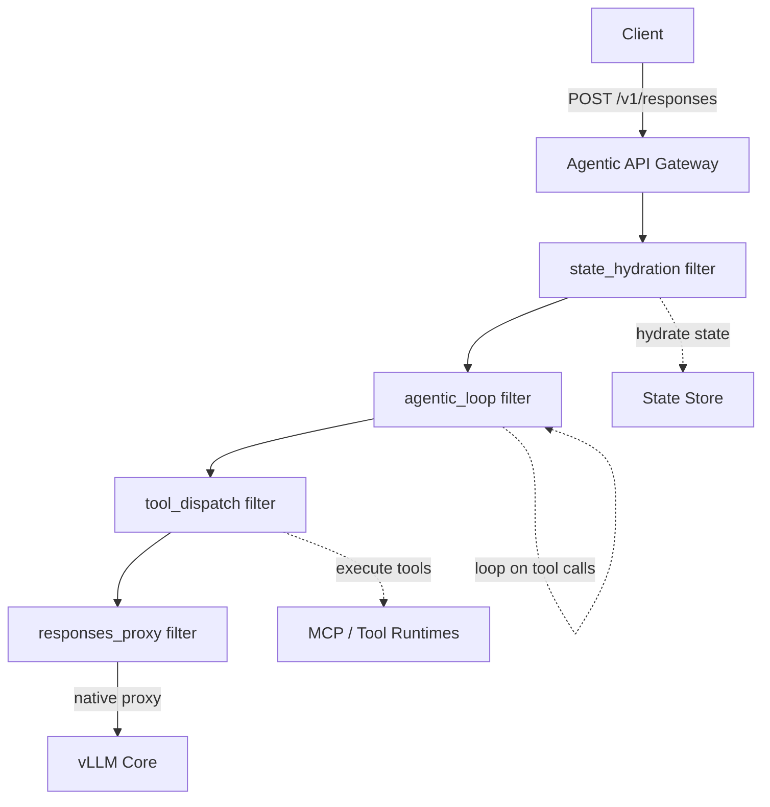

# Architecture

## Overview

The vLLM Agentic API is a Rust-based gateway built on [Praxis](https://github.com/praxis-proxy/praxis), a composable filter-based proxy framework. Each gateway concern is an independent Praxis filter, composed into a pipeline via YAML configuration.



**Stateless path:** Requests without `previous_response_id` flow straight through to vLLM Core.

**Stateful path:** The `state_hydration` filter loads conversation history, the request goes to vLLM, and if tool calls are detected, the `agentic_loop` and `tool_dispatch` filters handle execution and re-inference.

## Filter Pipeline

The gateway is a pipeline of [Praxis filters](https://github.com/praxis-proxy/praxis/blob/main/docs/filters.md) — each filter implements the `HttpFilter` trait with hooks for request and response processing.

| Filter | Phase | Role |
|--------|-------|------|
| `state_hydration` | Request | Inspects `previous_response_id` and hydrates conversation history from the state store |
| `agentic_loop` | Response | Detects `function_call` output items in model responses and re-enters the inference loop |
| `tool_dispatch` | Response | Executes tool calls (MCP servers, code interpreter, file search) |
| `responses_proxy` | Request | Sets the upstream to vLLM's `/v1/responses` endpoint and injects auth credentials |

Filters are configured and ordered in `config/agentic-api.yaml`:

```yaml
filter_chains:
  - name: agentic
    filters:
      - filter: state_hydration
        store_base_url: "http://localhost:8080"
      - filter: agentic_loop
        max_iterations: 10
      - filter: tool_dispatch
      - filter: responses_proxy
        vllm_base_url: "http://localhost:8000"
```

Adding, removing, or reordering filters requires no code changes — just edit the YAML.

## Why Praxis

- **Composable** — Each filter is self-contained with no knowledge of other filters in the pipeline
- **YAML-configured** — The pipeline can be reconfigured without code changes
- **Native streaming** — Praxis/Pingora handles SSE streaming natively, delivering tokens to clients in real time
- **Hot reload** — Filter pipelines can be reloaded from YAML without restarting the server
- **AI-optimized** — Built-in body inspection (`StreamBuffer` mode), model-to-header routing, and MCP classification

## Key Components

### vLLM Core (Stateless Inference)

The upstream vLLM server implements a stateless version of the Responses API. It handles tokenization, chat templates, and inference. The gateway never duplicates this logic.

### State Store

Provides stateful building blocks: file storage, vector stores, search, and conversation history. The `state_hydration` filter calls into the store to load conversation context before inference.

### Tool Runtimes

Tool calls detected in model output are dispatched by the `tool_dispatch` filter. Supported runtime types include MCP servers, code interpreter, file search, and web search.

## Streaming

SSE streaming is handled natively by Praxis's underlying [Pingora](https://github.com/cloudflare/pingora) proxy engine. The `responses_proxy` filter sets the upstream target and returns `FilterAction::Continue`, letting Pingora forward the response stream directly to the client — no buffering, no reqwest intermediary.
