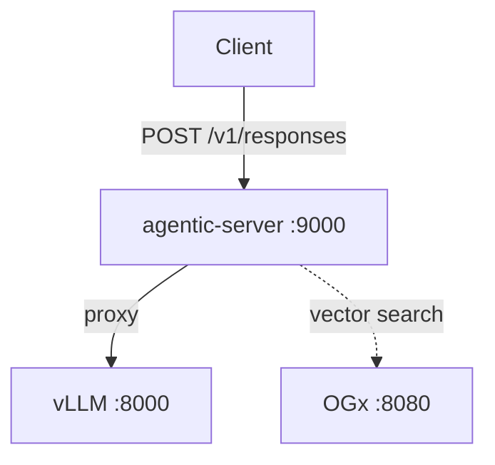

# Architecture

## Overview

The vLLM Agentic API is a Rust gateway that sits between clients and vLLM, adding stateful capabilities on top of vLLM's stateless Responses API. The gateway is structured as a three-crate workspace.



## Crate Structure

| Crate | Role |
|-------|------|
| `agentic-core` | Framework-agnostic core: inference caller, storage, vector search traits, OGx client |
| `agentic-server` | Axum HTTP server: routes, handler, CLI, agentic loop |
| `agentic-praxis` | Reserved for Praxis gateway adapter |

### agentic-core

Pure async Rust with no framework dependency. Contains:

- **Proxy** (`proxy.rs`) — HTTP client that forwards requests to vLLM with auth injection, header filtering, and streaming support
- **Readiness** (`readiness.rs`) — Polls vLLM's `/health` endpoint until ready
- **Storage** (`storage/`) — SQLx-based CRUD for conversations and responses (SQLite, PostgreSQL, MySQL)
- **Vector search** (`vector_search/`) — `VectorSearch` trait and OGx implementation for file_search tool calls
- **Types** (`types/`) — Serde structs for the Responses API IO types

### agentic-server

Axum-based HTTP server that wires everything together:

- **Handler** (`handler.rs`) — Request routing: runs the agentic loop if `file_search` tools are present, otherwise proxies to vLLM
- **App** (`app.rs`) — Router with `/health`, `/ready`, `/v1/responses` routes and CORS
- **CLI** (`main.rs`) — Clap-based CLI with `--llm-api-base`, `--ogx-base-url`, `--max-iterations`, and a `serve` subcommand that spawns vLLM as a subprocess

## Request Flow

### Passthrough (no tools)

```
Client → Gateway → vLLM → Gateway → Client
```

The request is forwarded to vLLM unchanged. Streaming responses are proxied as SSE.

### Agentic Loop (file_search)

When the request includes `tools: [{type: "file_search", vector_store_ids: [...]}]`:

1. Convert `file_search` to a `function` tool definition for vLLM
2. Send to vLLM (non-streaming, forced `stream: false`)
3. If vLLM returns `function_call` output items with `name: "file_search"`:
    - Extract the query from the call arguments
    - Search each vector store via OGx (`POST /v1/vector_stores/{id}/search`)
    - Append the tool call output and search results to the input
    - Go to step 2
4. If no tool calls, return the final response to the client
5. If `max_iterations` is reached, return a 502 error

## OGx Integration

[OGx](https://github.com/meta-llama/llama-stack) provides the vector search backend via its OpenAI-compatible API:

| Endpoint | Purpose |
|----------|---------|
| `POST /v1/vector_stores/{id}/search` | Execute vector search for file_search tool calls |

The `OgxStore` struct implements the `VectorSearch` trait, so the handler depends on the trait, not OGx directly.
